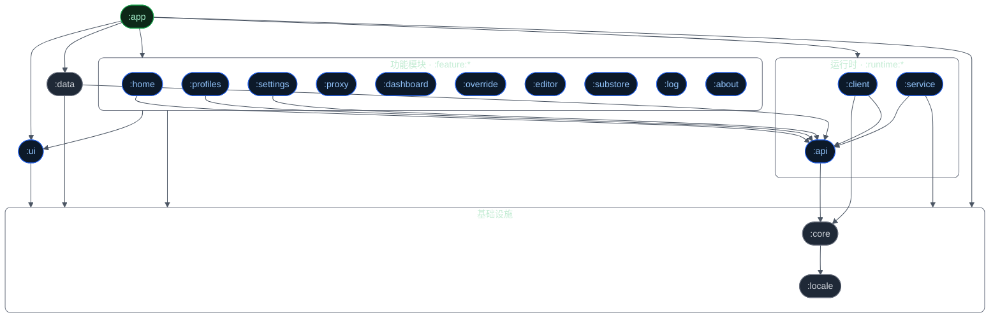
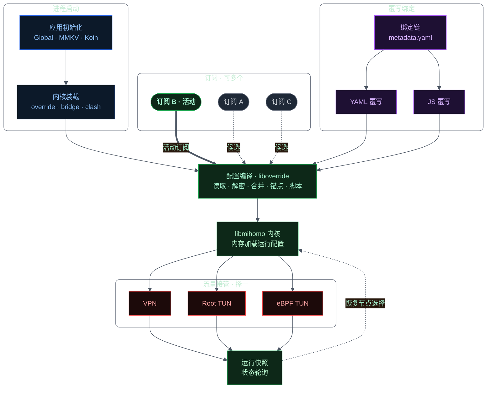

<Frame>
  
</Frame>

<Info>如果结局是分开，那相遇的意义是什么 --  **恋×シンアイ彼女**</Info>

## 特别

**[FlyCat](https://github.com/LM-Firefly/FlyCat) 是一个基于 [YumeBox](https://github.com/YumeYucca/YumeBox) 的开源 Android 客户端，使用 [mihomo](https://github.com/MetaCubeX/mihomo) 作为内核，提供代理管理与配置覆写等功能。**

**FlyCat 继承了 YumeBox 的核心理念：尽可能少地覆写原配置中的内容，非必要不进行覆写，拒绝将明确的配置[字段](https://wiki.metacubex.one/config/)抽象为模棱两可的功能开关。**
## 发展

FlyCat 基于 YumeBox 持续迭代，未来将一直保持 **开源 & 免费**，承诺不会有任何收集隐私、上传数据或广告行为。

## 下载
如果需要历史版本，请查看 [更新日志](/update/history)
<Card title="下载" icon="square-arrow-down" horizontal href="https://github.com/LM-Firefly/FlyCat/releases">
   前往 Github Release 下载安装包
</Card>

## 快速开始

<CardGroup cols={2}>
    <Card title="下载发布版本" icon="download" href="https://github.com/LM-Firefly/FlyCat/releases">
        在 GitHub Releases 获取最新 APK。
    </Card>

    <Card title="GitHub 仓库" icon="github" href="https://github.com/LM-Firefly/FlyCat">
        查看源码、提交 Issue、参与贡献。
    </Card>

    <Card title="问题反馈" icon="bug" href="https://github.com/LM-Firefly/FlyCat/issues">
        遇到问题或有建议时在此反馈。
    </Card>

    <Card title="更新日志" icon="clock" href="/update/history">
        查看版本更新历史
    </Card>
</CardGroup>

## 其他资料

<CardGroup cols={2}>
    <Card title="Mihomo 内核" icon="cpu" href="https://github.com/MetaCubeX/mihomo">
        基于 MetaCubeX/mihomo 内核，稳定可靠。
    </Card>

    <Card title="强大的覆写支持" icon="box" href="/override/override">
        使用修饰符的自定义覆写配置,对订阅进行覆写
    </Card>

    <Card title="SubStore 支持" icon="store" href="https://github.com/sub-store-org/Sub-Store">
        可选 SubStore 支持，配置管理更方便。
    </Card>

    <Card title="Web 面板" icon="monitor" href="https://github.com/MetaCubeX/metacubexd">
        内置 Web 面板，便于管理和监控。
    </Card>

    <Card title="配置文档" icon="settings" href="https://wiki.metacubex.one/config/">
        查看 mihomo 配置说明与最佳实践。
    </Card>
</CardGroup>

## 模块依赖

## 启动流程

